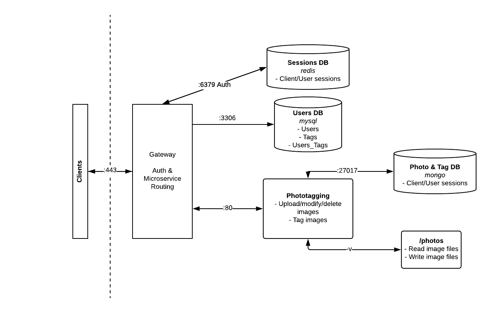

# Project Proposal

Andrew Hwang & Kari Nasu

INFO 441 - WI19

# Project Description

To make the process of sharing and organizing photos more robust, our application will provide users with a platform to classify and share photos by tags. Our application could be used by various audiences (e.g. professional photographers, companies for social media purposes, etc.). However, we will focus on the **general individual who prefers a flexible method of storing and sharing photos which surpasses the capabilities and use cases of typical, statically-structured file systems**. Such a user would be able to better personalize their photo-viewing and photo-sharing experience by using our application.

This audience would want to use our application for a number of reasons, the initial one likely being the want or need to organize photos based on multiple factors. For example, a student may want to view groups of photos based on their year in college (i.e. freshman, sophomore, etc.), calendar year, _and _their birthday. By tagging photos appropriately, the user can accomplish multiple photo-viewing and photo-sharing experiences. In this case, he/she could recapitulate their senior year as they near graduation, the calendar year as New Year's Day approaches, and how they have spent their past birthdays.

As a developer, we can now take a direct approach to responding to ideas and people's needs. I have personally dealt with the limitations of current photo-viewing and sharing platforms, and have seen people around us experience the same issue. From forgetting which classification a certain photo is under in a file system to tediously and manually sharing select photos with various people, users have different pain points that can be addressed in this application. Overall, we see this application being able to address various pain points in diverse scenarios.

# Technical Description

## Architecture

## User Stories

<table>
  <tr>
   <td>Priority 
   </td>
   <td>
    User
   </td>
   <td>
    Description
   </td>
  </tr>
  <tr>
   <td>
    P0
   </td>
   <td>
    As a photo owner, I want to
   </td>
   <td>Upload photos in large quantities
   </td>
  </tr>
  <tr>
   <td>
    P0
   </td>
   <td>
    As a photo owner, I want to
   </td>
   <td>Tag photos in large quantities
   </td>
  </tr>
  <tr>
   <td>
    P0
   </td>
   <td>
    As a user, I want to
   </td>
   <td>Search based on multiple tags
   </td>
  </tr>
  <tr>
   <td>
    P0
   </td>
   <td>
    As a user, I want to
   </td>
   <td>Create an account
   </td>
  </tr>
  <tr>
   <td>
    P1
   </td>
   <td>
    As a photo owner, I want to
   </td>
   <td>Share photos to friends based on tags
   </td>
  </tr>
  <tr>
   <td>
    P1
   </td>
   <td>
    As a photo owner, I want to
   </td>
   <td>Remove friends from viewing tags
   </td>
  </tr>
  <tr>
   <td>
    P1
   </td>
   <td>
    As a user, I want to
   </td>
   <td>See all tags that exist
   </td>
  </tr>
  <tr>
   <td>
    P2
   </td>
   <td>
    As a user, I want to
   </td>
   <td>Download photos individually or in groups
   </td>
  </tr>
  <tr>
   <td>
    P3
   </td>
   <td>
    As a user, I want to
   </td>
   <td>See # of photos per tag
   </td>
  </tr>
  <tr>
   <td>
    P3
   </td>
   <td>
    As a user, I want to
   </td>
   <td>Save searches/queries for quick access
   </td>
  </tr>
  <tr>
   <td>
    P3
   </td>
   <td>
    As a user, I want to
   </td>
   <td>See most recent searches/queries and click for quick access
   </td>
  </tr>
</table>

## Application Endpoints

User has to be authenticated to reach all endpoints. Otherwise, will respond with 401: Status Unauthorized.

<table>
  <tr>
   <td>Endpoint</td>
   <td>Description</td>
   <td colspan="3" >Implementation</td>
   <td>Response Codes</td>
  </tr>
   <tr>
      <td>
         <h3>GET /photos</h3>
      </td>
   <td>Gets photos all photos the user is able to view</td>
   <td colspan="3" >The user can view all the photos they are authorized to see. To do this, the browser would send a GET request to /photos. 
   </td>
   <td>200: Successfully retrieved photos
      

      400: Bad request
      

      500: Internal server error
   </td>
  </tr>
   <tr>
      <td>
      	<h3>POST /photos</h3>
      </td>
      <td>Uploads at least one new photo to the database and user account</td>
      <td colspan="3" >The Photos microservice will handle when a user uploads an image by saving the image in the graph database associated with the UserID and datetime .
      </td>
      <td>201: Created
         

         415: Unsupported media type
         

         500: Internal server error
      </td>
  </tr>
  <tr>
   <td>
      <h3>GET /photos/:tagID</h3>
   </td>
   <td>Gets photos that are tagged with the specified tag
   </td>
   <td colspan="3" >The user can click a certain tag and see the photos it is used on. This will send a GET request to the Photos microservice, which will then return all photos with the specified tag that the client is allowed to see. 
   </td>
   <td>200: Successfully retrieved photos
      

      400: Bad request
      

      500: Internal server error
   </td>
  </tr>
   <tr>
      <td>
         <h3>POST /photos/:photoID</h3>
      </td>
      <td>Likes OR unlikes a specific photo</td>
      <td colspan="3" >If the user is not already a liker, a like will be added. If the user is a liker, the like will be removed.</td>
      <td>200: Successfully liked or unliked
         

         403: The request user is not the photo owner or the user is not a permitted viewer
         

         404: PhotoID does not exist
         

         500: Internal server error
      </td>
   </tr>
  <tr>
  <tr>
   <td>
      <h3>DELETE /photos/:photoID</h3>
   </td>
   <td>Deletes a photo from the database and user account</td>
   <td colspan="3" >Deletes an image from the database. Returns a plain text message that the delete was successful and returns the images the client is able to see based on the previous search queries. If client was not in the middle of a search, it will return all images the user is allowed to see.</td>
   <td>200: Successfully deleted photo
      

      403: The request user is not the photo owner
      

      404: PhotoID does not exist
      

      500: Internal server error
   </td>
  </tr>
  <tr>
   <td>
      <h3>POST /photos/:photoID/:tagID</h3>
   </td>
   <td>Adds one tag for a photo</td>
   <td colspan="3" >A user can tag a photo with an existing tag or a new one. When a user tags a photo, the Photos microservice will handle the event and update the database.
   </td>
   <td>
      

      201: Created
      

      403: The user is not the photo or tag owner
      

      500: Internal server error
   </td>
  </tr>
  <tr>
   <td>
      <h3>DELETE /photos/:photoID/:tagID</h3>
   </td>
   <td>Deletes one tag from a photo
   </td>
   <td colspan="3" >A user can remove a tag from a photo. The Photos microservice will handle this event and update the database.
   </td>
   <td>
      

      200: Successfully removed tag
      

      403: The user is not the photo or tag owner
      

      404: PhotoID does not exist or TagID does not exist
      

      500: Internal server error
   </td>
  </tr>
  <tr>
   <td>
   <h3>POST /users</h3>
   </td>
   <td>Creates a new user account
   </td>
   <td colspan="3" >One can create a new account via a POST request to /user. User is saved in a MySQL database.
   </td>
   <td>201: Created
      

      415: Unsupported media type
      

      500: Internal server error
   </td>
  </tr>
  <tr>
   <td>
<h3>GET </h3>
<h3>/tags</h3>
   </td>
   <td>Returns all tags the user is able to see
   </td>
   <td colspan="3" >One can see all the tags they have created or shared to via a GET request to /tags.
   </td>
   <td>200: Successfully retrieved tags
      

      400: Bad request
      

      500: Internal server error
   </td>
  </tr>
   <tr>
      <td>
         <h3>POST /tags</h3>
      </td>
      <td>Creates a new tag</td>
      <td colspan="3" >A user can create a new tag.</td>
   <td>201: Successfully created tag
      

      400: Bad request
      

      500: Internal server error
   </td>
  </tr>
  <tr>
  <tr>
   <td>
      <h3>GET /tags/:tagID</h3>
   </td>
   <td>Gets metadata about specific tag</td>
   <td colspan="3" >A user can request information about a specific tag, such as number of photos, friends shared with, etc.
   </td>
   <td>200: Successfully retrieved tag information
      

      400: Bad request
      

      404: TagID does not exist
      

      500: Internal server error
   </td>
  </tr>
  <tr>
   <td>
      <h3>DELETE /tags/:tagID</h3>
   </td>
   <td>Deletes specific tag from all photos it is posted on</td>
   <td colspan="3" >A user can delete a tag, resulting in the removal of that tag from all the photos it's attached to and removal of permissions for friends to see photos with this tag.
   </td>
   <td>200: Successfully deleted tag
      

      403: The request user is not the tag creator
      

      404: TagID does not exist
      

      500: Internal server error
   </td>
  </tr>
  <tr>
   <td>
      <h3>POST /tags/:tagID/:userID</h3>
   </td>
   <td>Add a user to a tag
   </td>
   <td colspan="3" >An owner of photos can add friends to a tag so they can view photos with the tag.
   </td>
   <td>200: Successfully added member to tag
      

      404: UserID does not exist or TagID doesn't exist
      

      500: Internal server error
   </td>
  </tr>
  <tr>
   <td>
      <h3>DELETE /tags/:tagID/:userID</h3>
   </td>
   <td>Delete a user from a tag</td>
   <td colspan="3" >An owner of photos can remove friends from a tag, thus revoking their permission to view photos with the tag.
   </td>
   <td>200: Successfully deleted tag
      

      403: The request user is not the tag creator
      

      404: UserID or TagID does not exist
      

      500: Internal server error
   </td>
  </tr>
</table>

## Appendix

## Database Schemas

Users

create table if not exists users (

    id int not null auto_increment primary key,

    email varchar(320) not null,

    firstname varchar(128) not null,

    lastname varchar(128) not null,

    username varchar(255) not null UNIQUE,

    passhash binary(60) not null,

    photourl varchar(2083) default null

);

create table if not exists tags (

    id int not null auto_increment primary key,

    name varchar(128) not null,

    description varchar(320) not null

);

create table if not exists users_tags (

    user_id int not null foreign key,

    tag_id int not null foreign key

);

Photos

Sessions

Redis key-value store that associates sessionIDs with RedisStore objects, seen below: 

type RedisStore struct{

	Client          		*redis.Client \
	SessionDuration 	time.Duration

}

